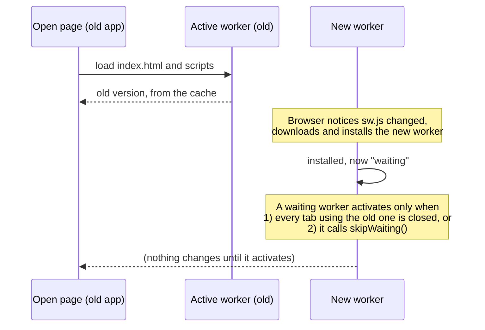

# The update that never arrived: a stale service worker

**Date:** 7 October 2026 · **Versions:** v0.1.0 to v0.3.1 · **Fix:** [PR #4](https://github.com/rj8228/galois/pull/4)

## Summary

After v0.3.0 shipped the Learn section, the live site kept showing the old "Learn: Arrives in Phase 3" page. Reloading didn't help. The new version had been downloaded by the browser but was never allowed to run, because of how the offline service worker was configured. The fix makes a new worker take over by itself as soon as it's downloaded.

## What the user saw

- v0.3.0 was deployed and the GitHub Pages files were correct.
- The browser still showed v0.2's Learn placeholder, "Arrives in Phase 3", after reloads.
- Nothing on the page said an update was waiting.

## Background: how a service worker updates

Since v0.1.0, Galois has been a PWA. A service worker caches the app so it works offline, and it serves `index.html` and every script from that cache. That's why the old version kept appearing: the browser never asked the network for the page.

An update goes through these stages:



The key rule is that a new worker **waits** until either every page using the old worker is closed, or it calls `skipWaiting()`. On a phone, or an installed PWA, the old tab is rarely fully closed, so "wait" can mean forever.

## What went wrong

| Version | Service worker mode | What the new worker did |
| --- | --- | --- |
| v0.1.0 – v0.2.0 | vite-plugin-pwa `autoUpdate`, default registration script | Took over by itself |
| v0.3.0 | `prompt` (to show a "new version is ready, reload?" message) | **Waited** until the page sent it a "skip waiting" message |

`prompt` mode is a reasonable design: the new worker waits, the page shows a message, and the person taps Reload. That tap sends the worker a message telling it to activate.

But the code that shows the message and sends that request was part of the **new** app, v0.3.0. The browser was still running the **old** app, v0.2.0, which had no such code. So:

1. The browser downloaded the v0.3.0 worker. ✅
2. The worker installed and waited for a message. ⏳
3. The page that should send the message was the old one, which didn't know how. ❌
4. The update stayed stuck until every tab was closed.

**The root cause:** the code that unlocks an update lived inside the update itself. Any change to how updates are delivered has to work for pages still running the previous version.

## A second surprise during the fix

The first fix attempt switched back to `autoUpdate` mode, which I assumed made the worker skip waiting. Testing showed the new worker **still waited**. In this setup (vite-plugin-pwa 2.0 with our own registration via `virtual:pwa-register`), the generated `sw.js` contained no `skipWaiting()` call. Skipping the wait was again triggered by a message from the page, and old pages never send it.

The working fix sets this explicitly in `vite.config.ts`:

```ts
workbox: {
  skipWaiting: true,      // activate as soon as installed, even if old pages never ask
  clientsClaim: true,     // take control of already-open pages
  cleanupOutdatedCaches: true,
  // …
}
```

The fix was confirmed by checking that the built `dist/sw.js` contains `skipWaiting()` and `clientsClaim()`, not by trusting the config name.

## How it was verified

Both checks were done locally with the real builds, served from the same address:

1. **Old to fixed.** v0.3.0 was installed and controlling the page, then the fixed build replaced it on the server. After one reload the page showed the new version, with nothing waiting.
2. **Fixed to newer.** From the fixed version, a test build with a changed tagline was deployed. The page reloaded onto it by itself.

## Why the tests didn't catch it

- The Playwright suite runs with `serviceWorkers: 'block'`, so every test sees a fresh build. That was deliberate, to avoid stale caches in tests, but it also means no test ever performs an upgrade.
- **The warning signs were there earlier and were worked around instead of investigated.** During the Phase 1 and Phase 2 checks, the browser twice showed the previous version: an old "Resume" button label, and a missing Invariants card. Both times the fix was to unregister the worker and clear caches, which hid the problem. A real visitor can't do that.

## Learnings to reflect on

1. **Updates must work for the version people actually have, not the one you're shipping.** Anything that changes how updates are delivered runs first inside the old version.
2. **A stale page during testing is a bug report, not an inconvenience.** If clearing a cache is the fix during development, ask what a real user would do.
3. **Check the built output, not the config's intent.** `autoUpdate` sounded like "skips waiting"; the generated `sw.js` said otherwise.
4. **Tests that disable a feature can't catch that feature's bugs.** Blocking service workers made tests reliable and blind to upgrade bugs at the same time.
5. **Offline caching trades freshness for availability.** For a site that changes daily during a build, that trade needs an explicit, tested update path.

## Follow-ups

- [ ] Add an automated upgrade test: serve build A, let its worker take control, swap in build B, and assert the page reaches B within one reload.
- [ ] Show a small "Updated to vX.Y" note after an automatic reload, so the change is visible rather than surprising.
